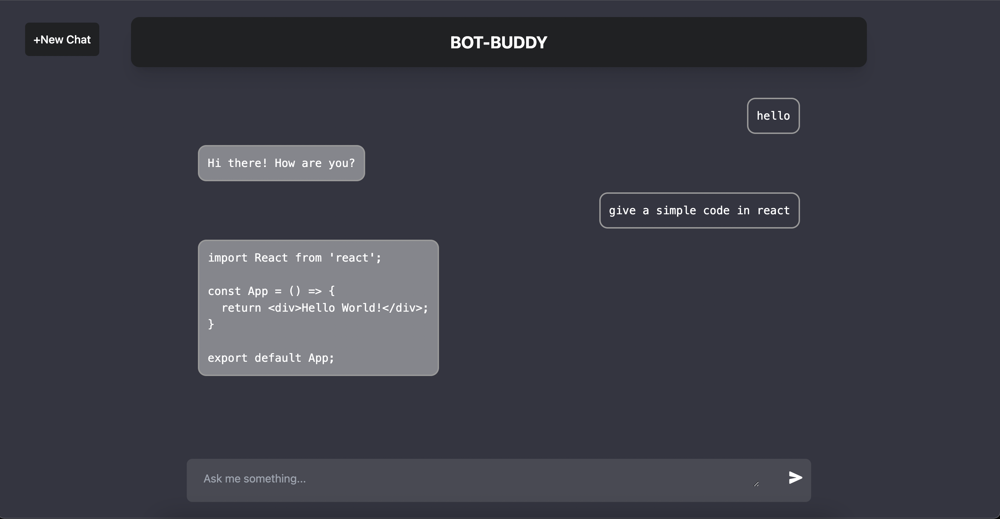
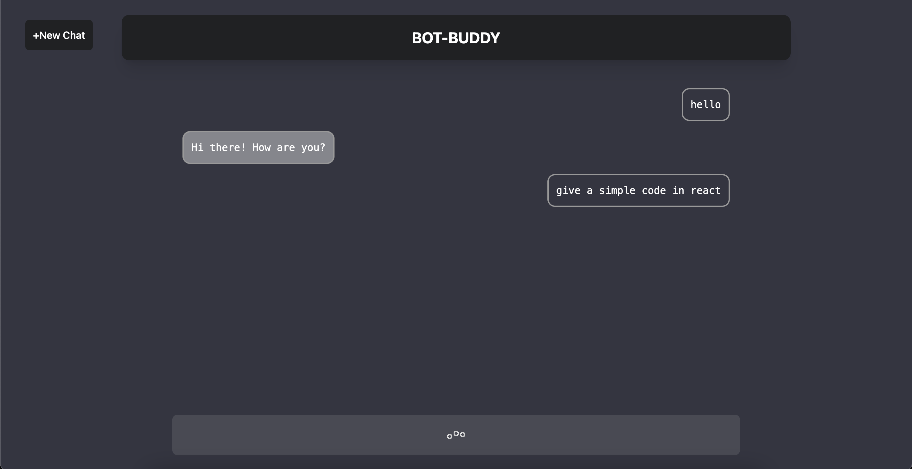
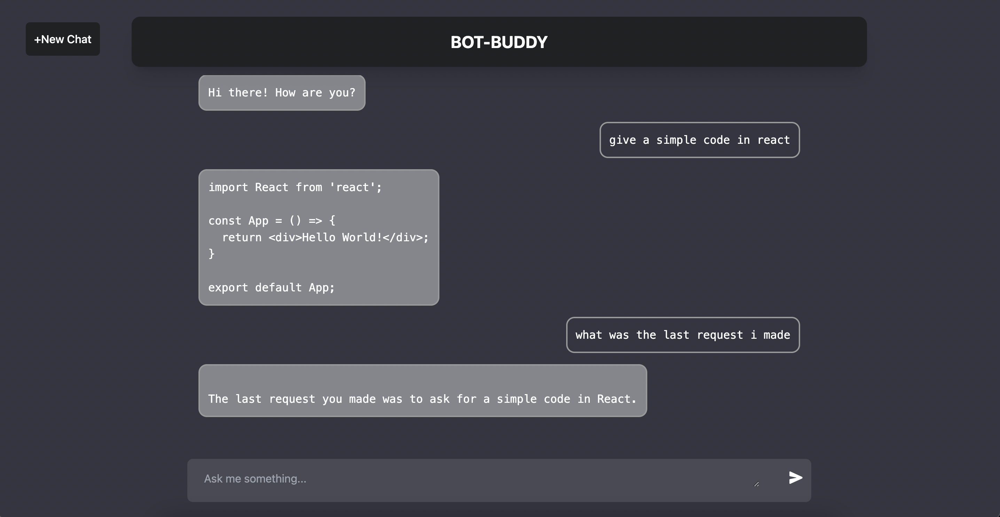

# AI-Chatbot
A chatbot application that allows users to interact with an AI-powered chatbot and ask questions and follow-ups.
## Features

- User-friendly interface for chatting with an AI-powered chatbot.
- Real-time conversation updates and smooth message transitions.
- Dynamic follow-up question-answering functionality.
- Seamless integration with the OpenAI API for generating AI responses.
- New chat button to clear previous conversations.

#### Generate relevant answers using the latest "text-davinci-003" model:

#### Loading icon display:

#### Ability to respond to follow-ups:

## Tech-Stack used :

  
  
  
  
  
  
  

## Acknowledgements

The chatbot application utilizes the OpenAI API to generate responses. Special thanks to OpenAI for providing this powerful API.
